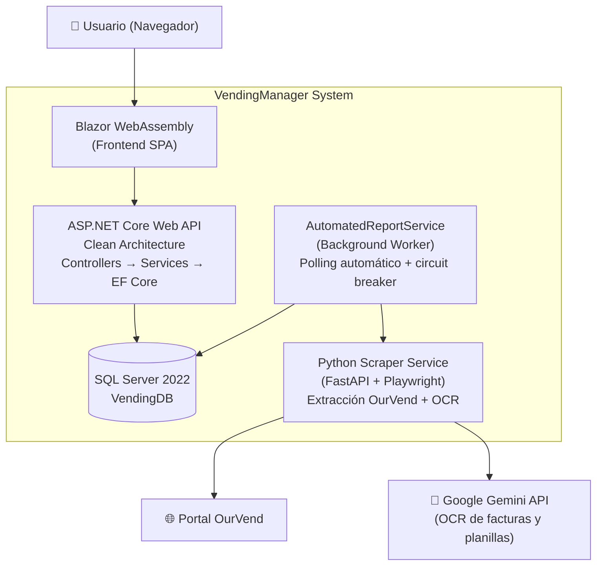

# VendingManager 🏭


> Plataforma integral para la gestión de negocios de máquinas expendedoras. Controlá inventario, finanzas, operaciones y analítica desde un solo lugar, con trazabilidad total y sincronización inteligente.

---

## 🎯 ¿Qué problema resuelve?

Gestionar un negocio de vending sin sistema es un caos: las ventas se anotan en papel, los costos se calculan en Excel, y la trazabilidad del dinero que entra y sale se pierde entre planillas. Cuando un trabajador rinde cuentas, no hay forma de conciliar rápido, y al cierre del mes nunca tenés certeza de si ganaste o perdiste.

**VendingManager automatiza todo ese proceso.** Conecta cada venta de cada máquina con tu caja, tu inventario y tus gastos, y te da _en tiempo real_ los números que importan. Además, **el sistema sincroniza automáticamente las máquinas** con el portal OurVend durante todo el día — cero trabajo manual, cero olvidos.

El resultado: sabés exactamente cuánto ganó el negocio cada mes, con costos precisos porque el sistema guarda el valor de cada producto al momento exacto de cada venta. Sin planillas, sin errores, sin depender de la memoria de nadie.

---

## 🧱 Stack Tecnológico

| Capa | Tecnología |
|------|-----------|
| Backend | .NET 10, ASP.NET Core |
| Frontend | Blazor WebAssembly |
| Base de Datos | SQL Server 2022 |
| Scraping & OCR | Python, FastAPI, Playwright, Google Gemini |
| Infraestructura | Docker, Docker Compose |
| Arquitectura | Clean Architecture, Repository Pattern |
| Testing | xUnit, Moq, FluentAssertions |

---

## ⚡ Funcionalidades Principales

- 📡 **Sincronización Automática** — El sistema consulta el portal OurVend cada ~2 horas dentro del horario comercial, descarga las ventas de todas las máquinas y las procesa. Detecta duplicados automáticamente, y un _circuit breaker_ con backoff progresivo protege el acceso ante fallos o bloqueos del portal.

- 🤖 **OCR con Inteligencia Artificial** — Sacale una foto a la factura del proveedor o a la lista de carga manuscrita. Google Gemini extrae proveedor, productos, cantidades y precios en segundos. El sistema además reconoce códigos EAN y los asocia a tu catálogo automáticamente.

- 📈 **Rentabilidad en Tiempo Real** — El Estado de Resultados (P&L) se calcula automáticamente usando costos históricos reales. Cuando vendés un producto, el costo se congela al valor exacto de ese momento: ventas menos costo de venta, menos gastos variables y fijos. Sin promedios genéricos que distorsionan los números.

- 🔍 **Conciliación Transbank** — Subí el archivo de pagos y el sistema cruza cada pago con su venta. Si alguien compró varios productos en un solo pago, un algoritmo de _bundle matching_ encuentra la combinación exacta de ventas. Los pagos sin venta asociada quedan registrados para revisión: nada desaparece.

- 📊 **Analítica Predictiva** — Ranking ABC de productos, clasificación por rotación y margen, predicción de quiebres de stock basada en velocidad de venta real, y sugerencia de compras a 30 días priorizada por criticidad. Sabés qué productos te conviene mantener y cuáles no.

- 🔐 **Auditoría y Trazabilidad** — Cada creación, modificación o eliminación de cualquier entidad queda registrada automáticamente: quién lo hizo, cuándo, y qué cambió. Si alguien se equivoca, podés revertir cualquier registro a su estado anterior con un clic desde el panel de administración.

- 🚚 **Logística de Reposición** — Generá órdenes de carga desde plantillas inteligentes. Registrá qué llevaste y qué sobró. Al finalizar, el sistema descuenta de bodega, actualiza los slots de la máquina, y registra el costo en Caja automáticamente.

- 📋 **Plantillas de Recarga Inteligente** — Planificá ciclos de reposición con múltiples períodos. El sistema analiza velocidad de venta por slot, predice cuándo se va a vaciar cada producto y detecta slots que no vendieron nada. Cruzás datos entre todos los ciclos de una misma máquina.

---

## 🏗️ Arquitectura



### Patrones de Diseño

| Patrón | Aplicación |
|--------|-----------|
| Clean Architecture | Separación Core / Infrastructure / Presentation |
| Repository Pattern | Abstracción de acceso a datos |
| State Machine | Ciclos de vida de templates y transferencias |
| Interceptor Pattern | Auditoría automática transparente |
| Facade Pattern | Servicios compuestos con delegación |

---

## 📊 El Proyecto en Números

| Métrica | Valor |
|---------|-------|
| Pantallas | 27 |
| Endpoints API | 160+ |
| Controladores | 19 |
| Entidades de negocio | 26 |
| Tablas de historial (auditoría) | 12 |
| Tests automatizados | 1150+ |
| Entornos Docker | 3 (dev, test, prod) |

---

## 🚀 Quick Start

Requisitos: Docker.

```bash
git clone https://github.com/MaximilianoVorphal/VendingManager.git
cd VendingManager

# Crear el archivo .env que usa Docker Compose
cat > .env << 'EOF'
MSSQL_SA_PASSWORD=ChangeMe@Password!2026
OURVEND_USER=
OURVEND_PASS=
GEMINI_API_KEY=
EOF

docker-compose up -d
```

La app corre en `http://localhost:8080`. Las migraciones de base de datos se aplican automáticamente e incluyen un usuario inicial:

| Usuario | Contraseña |
|---------|------------|
| `admin` | `admin` |

La app emite una advertencia al arrancar mientras la contraseña por defecto no haya sido cambiada; puede rotarse definiendo la variable de entorno `SEED_ADMIN_PASSWORD`.

> Las credenciales de OurVend y la clave de Gemini son opcionales: sin ellas la app funciona completa, solo que sin sincronización automática de ventas ni OCR.

---

## 📚 Documentación

- 📖 [Dominios de Negocio](docs/README.md) — 6 documentos que cubren cada área del sistema
- 🏗️ [Arquitectura](docs/arquitectura.md) — Diagramas C4, capas, patrones de diseño
- 🔌 [API Reference](docs/api.md) — Catálogo completo de endpoints REST
- 🗄️ [Modelo de Datos](docs/entidades.md) — Entidades, relaciones y decisiones de modelado
- ⚙️ [Guía de Desarrollo](docs/desarrollo.md) — Setup, convenciones y testing
- 🚀 [Guía de Despliegue](docs/despliegue.md) — Docker, entornos y health checks

---

## 📄 Licencia

MIT

---

> **Nota**: Este proyecto fue desarrollado como un sistema de gestión integral real para un negocio de vending, cubriendo desde la ingesta automática de datos hasta la auditoría financiera.
