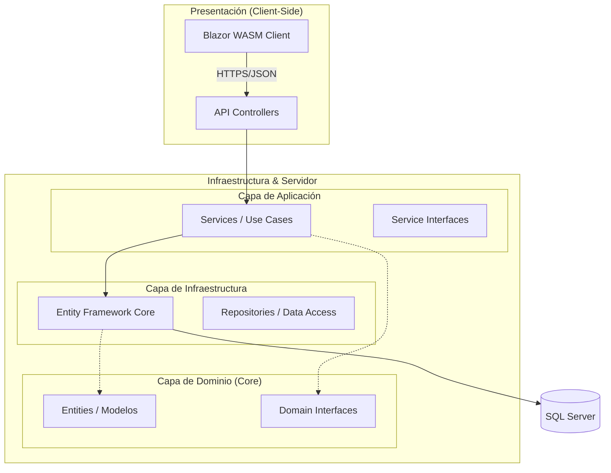
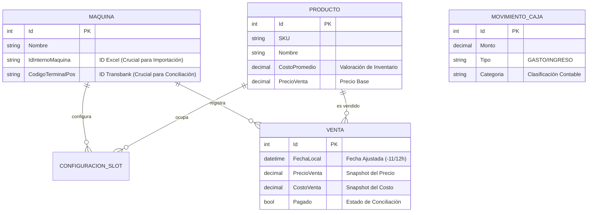

# Documentación de Arquitectura de VendingManager

Este documento técnico ofrece una visión integral de la arquitectura, el diseño y las tecnologías empleadas en la plataforma **VendingManager**. Está diseñado para proporcionar a los desarrolladores y arquitectos un entendimiento profundo del sistema para facilitar el mantenimiento, la escalabilidad y la toma de decisiones estratégicas.

---

## 1. Resumen Ejecutivo
**VendingManager** es una solución empresarial diseñada para la gestión operativa y financiera de máquinas expendedoras. El sistema centraliza la ingesta de datos desde reportes manuales (Excel) y transacciones bancarias (Transbank), realizando una conciliación automática para garantizar la integridad financiera y el control de inventario.

---

## 2. Stack Tecnológico

El proyecto está construido sobre un stack moderno de Microsoft, aprovechando las últimas características de rendimiento y desarrollo.

### Backend & API
*   **Framework**: .NET 10 (Preview)
*   **Lenguaje**: C# 13
*   **ORM**: Entity Framework Core 10.0.1 (Code-First)
*   **Base de Datos**: Microsoft SQL Server
*   **Documentación API**: Scalar / OpenAPI (Swagger)

### Frontend (SPA)
*   **Framework**: Blazor WebAssembly (.NET 10)
*   **Lenguaje**: C# / Razor
*   **Estilos**: CSS Nativo (Diseño Industrial/Oscuro)

### Librerías Clave
*   **Manipulación de Datos**: `MiniExcel`, `ClosedXML`, `ExcelDataReader` (Procesamiento de reportes masivos).
*   **Automatización**: `Selenium.WebDriver` (Automatización de tareas web externas).

---

## 3. Arquitectura del Sistema

El sistema implementa estrictamente **Clean Architecture (Arquitectura Limpia)**, asegurando la separación de preocupaciones y la independencia de frameworks externos.



### Organización del Proyecto
La estructura de carpetas refleja directamente las capas arquitectónicas:

| Capa | Directorio | Responsabilidad |
| :--- | :--- | :--- |
| **Domain** | `VendingManager/Core/Entities` | Contiene los objetos de negocio puros (`Maquina`, `Venta`). No tiene dependencias externas. |
| **Application** | `VendingManager/Infrastructure/Services` | Contiene la lógica de negocio (`VentasService`, `CajaService`). Orquesta los datos entre la base de datos y el cliente. |
| **Infrastructure** | `VendingManager/Infrastructure/Data` | Implementación técnica de acceso a datos (`ApplicationDbContext`). |
| **Presentation** | `VendingManager.Web` | Interfaz de usuario que consume la API. |

---

## 4. Diseño de Base de Datos

El modelo de datos está normalizado y diseñado para soportar alta integridad transaccional.



### Lógica Crítica de Negocio
1.  **Sincronización de Tiempo**: El sistema maneja una lógica compleja para ajustar la `FechaLocal` de las ventas, compensando la diferencia de ~11-12 horas entre los servidores de las máquinas y la zona horaria local.
2.  **Conciliación Financiera**: El campo `Pagado` en la entidad `Venta` se actualiza únicamente cuando una transacción de Transbank coincide exactamente en monto y proximidad temporal.

---

## 5. Despliegue e Infraestructura (Docker)

El proyecto está contenerizado para facilitar el despliegue en cualquier entorno que soporte Docker.

**Dockerfile Multi-Stage Build:**
1.  **Base**: Imagen mínima de ASP.NET Core Runtime.
2.  **Build**: Utiliza el SDK completo para compilar y restaurar dependencias.
3.  **Publish**: Genera los binarios optimizados.
4.  **Final**: Construye una imagen ligera exponiendo los puertos `8080/8081`.

**Comandos de Operación:**
```bash
# Construir la imagen
docker build -t vending-manager .

# Ejecutar el contenedor

---

## 6. Detalle de Lógica de Negocio

Esta sección profundiza en las reglas de negocio críticas implementadas en los servicios.

### 6.1 Gestión de Diferencias Horarias (Timezones)
Las máquinas expendedoras, al ser importadas de China, reportan en una zona horaria diferente. El sistema normaliza esto en la importación (`ExcelService`).

*   **Regla General**: Se restan **11 horas** a la fecha reportada por la máquina.
    *   `FechaLocal = FechaReportada - 11 horas`
*   **Excepción (Hardcoded)**: La máquina con ID `2410280012` tiene un desfase diferente.
    *   `FechaLocal = FechaReportada + 1 hora`

### 6.2 Lógica de Conciliación Bancaria (Transbank)
El sistema utiliza un algoritmo de **Doble Pasada** para conciliar los depósitos bancarios con las ventas físicas.

1.  **Pasada Estricta**: Busca ventas no pagadas que coincidan en **monto exacto** dentro de una ventana de **+/- 5 minutos**.
2.  **Pasada Holgada**: Si no hay match, amplía la ventana a **+/- 60 minutos** e intenta tolerancias de montos (para cubrir diferencias Netas/Brutas de comisiones).
3.  **Cobros Fantasma (Phantom Charges)**:
    *   Si hay dinero en Transbank pero NO hay venta física (ni siquiera en 60 mins), el sistema crea una **Venta Fantasma**.
    *   **Identificador**: `IdOrdenMaquina = "TB-EXTRA"`
    *   **Slot**: `-1`
    *   Esto asegura que la caja cuadre aunque la máquina haya fallado en registrar la venta.

### 6.3 Lógica de Reportes y Rentabilidad
La rentabilidad se calcula "Snapshot" (Foto del momento) para preservar la historia.

*   **Costo de Venta**: Al momento de procesar la venta, se guarda el `CostoPromedio` del producto en la columna `CostoVenta` de la tabla `Venta`.
    *   *Por qué*: Si el costo del producto cambia en el futuro, las ventas pasadas MANTIENEN su margen original.
*   **Ajuste de Rentabilidad**: `Ganancia = PrecioVenta - CostoVenta`.
    *   Si `CostoVenta` es 0 (ej. producto nuevo sin costo cargado), el reporte intenta usar `Producto.CostoPromedio` actual como fallback visual, pero la base de datos mantiene la integridad del 0 inicial.
