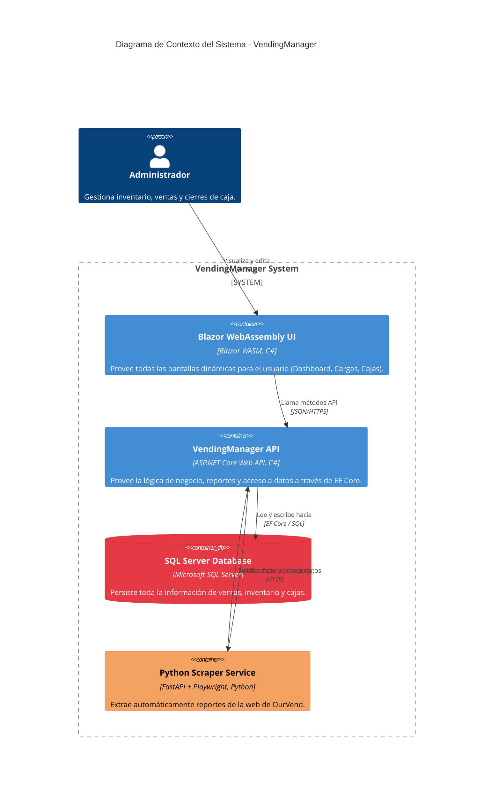
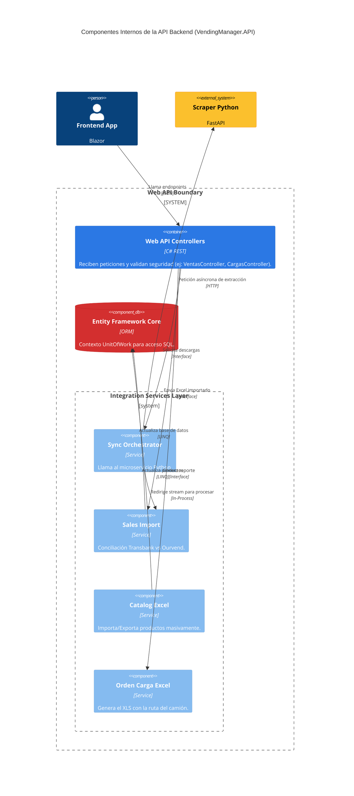

# Architecture Overview

Esta aplicación es un híbrido entre un Backend ASP.NET Core que provee Web APIs y renderizado inicial (Blazor Server), y un Frontend dinámico mediante Blazor WebAssembly. Adicionalmente interactúa con un microservicio Scraper escrito en Python (FastAPI + Playwright).

## Diagrama de Contexto (C4)

El siguiente diagrama muestra el esquema general de cómo interactúan los componentes dentro del entorno Docker:

## Patrones de Diseño Usados

1. **Clean Architecture:** El backend `.NET` divide su lógica en `Core` (Interfaces/Entidades), `Infrastructure` (Servicios, Data) y la Capa de Presentación (Controladores).
2. **Code-Behind:** En el cliente Blazor, las vistas grandes separan el archivo `.razor` del `.razor.cs`.
3. **Repository Pattern / Service Pattern:** Los controladores no hablan con EF Core de forma directa, lo hacen a través de interfaces (`ISalesImportService`, `ISyncOrchestratorService`, etc).

## Diagrama de Contenedores API (C4)

