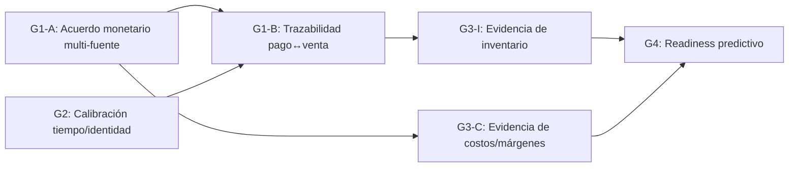

# Data Foundation Roadmap — VendingManager

Roadmap para establecer la base de datos reproducible que cualquier analítica o
funcionalidad posterior debe respetar. Sin esta base, ningún dashboard,
alerta predictiva o informe financiero tiene validez demostrable ante el negocio.

Este documento es la fuente canónica de estado, principios y decisiones del
camino hacia una fundación de datos fiable. La fuente ejecutiva actual es
Engram #1213 — `sdd/vending-data-foundation-roadmap/status` (proyecto
`vendingmanager`).

> **Estado:** planificación aprobada; solo documentación. Sin autorización
> para ejecutar capturas, cambiar código, ni implementar features.

---

## Principios

- **Objetivo:** evidencia reproducible para decisiones, no un score de
  readiness compuesto.
- **Tipos de afirmación:** hecho fuente (*source fact*), reconstrucción,
  estimación, proyección (*forecast*), causal.
- **Aprobación:** por máquina/ventana/contrato/versión; eslabón más débil;
  requiere owner + validador técnico independiente.
- **Prohibido:** verdad absoluta por acuerdo entre fuentes, offsets globales,
  umbrales arbitrarios, episodios de stockout mutables con semántica inestable.

---

## Modelo de compuertas (Gate Dependency Model)

El paso de cada compuerta está *scoped* a máquina/ventana/contrato/versión
específicos. Las compuertas G1-A y G2 son **independientes**: pueden evaluarse
por separado y una puede pasar mientras la otra permanece en estado
`characterizing` o `not-assessed`. Una afirmación compuesta (ej. conciliación
diaria multi-fuente) hereda el eslabón más débil de sus compuertas requeridas.

| Compuerta | Criterio | Unidad |
|-----------|----------|--------|
| **G1-A** | Acuerdo monetario multi-fuente scoped, usando filas completas devueltas por los reportes solicitados. Conteo de pagos y conteo de eventos de venta son unidades distintas. | `passed` / `characterizing` / `not-assessed` |
| **G2** | Calibración tiempo/identidad operacional por máquina, terminal, OV field, ventana y versión. `Fecha de movimiento` (Transbank) es referencia operacional solo para `Venta`/`ABONADA` elegibles, débito/prepago, timestamp no-medianoche, mapeo válido. No es verdad física ni propiedad de la fuente. | `passed` / `characterizing` / `not-assessed` |
| **G1-B** | Trazabilidad candidato pago↔venta después de G1-A + G2. Soporta one-to-one, many-to-many, bundle, ambiguo, source-only. Ningún candidato es verdad absoluta. | `candidate` / `blocked` / `not-assessed` |
| **G3-I** | Evidencia de inventario, independiente de costos. Sub-compuertas: conservación (G3-I.0), residual observado por operador antes de recarga (G3-I.1). | `not-assessed` |
| **G3-C** | Evidencia de costos/márgenes, compuerta independiente. Afirmaciones monetarias combinadas con stockout heredan G3-I + G3-C aplicables. | `not-assessed` |
| **G4** | Readiness predictivo solo después de compuertas relevantes aprobadas y modelos temporales que superen líneas base auditables. | `not-assessed` |

---

## Scorecard actual

Ventana evaluada: `[2026-07-06, 2026-07-13)`

| Máquina | Terminal | G1-A | G2 | G1-B | G3-I | G3-C | G4 |
|---------|----------|------|----|------|------|------|----|
| M23 `2410280023` | `SIV01099` | `passed` | `passed` | `candidate` | `not-assessed` | `not-assessed` | `not-assessed` |
| M12 `2410280012` | `SIV01066` | `characterizing` | `passed` | `blocked` | `not-assessed` | `not-assessed` | `not-assessed` |
| M24 | — | `not-assessed` | `characterizing` | `not-assessed` | `not-assessed` | `not-assessed` | `not-assessed` |
| Global / otras | — | `not-assessed` | `not-assessed` | `not-assessed` | `not-assessed` | `not-assessed` | `not-assessed` |

### Detalle M23

- **G1-A `passed`:** $143.130 en ambas fuentes (Transbank TB = $143.130;
  OurVend OV = $143.130). 126 registros de pago TB vs 131 eventos de venta OV.
  Evidencia de bundle y ambigüedad documentada.
- **G2 `passed`:** delta MachineTime candidato −721 min. Aprobación operacional
  scoped a máquina/terminal/ventana/versión.
- **G1-B `candidate`:** 73 pares determinísticos más evidencia de
  ambigüedad/source-only/bundle.

### Detalle M12

- **G2 `passed`:** delta MachineTime candidato −1 min. Aprobación operacional
  scoped.
- **G1-A `characterizing`:** delta reporte −$30 bajo contrato de membresía
  *returned-report*. Sin tolerancia; no más análisis sin evidencia externa.
- **G1-B `blocked`:** no hay candidatos. No se observaron bundles.

### G3-I.0 / I.1

- `not-assessed`. Boundary Policy v1 aprobada. Piloto de captura M23
  planificado/diferido sin mecanismo, captura ni código autorizado.

### Detalle M24

- **G2 `characterizing`:** inspección visual de campo (2026-07-21) confirmó:
  - Selector de controlador entre `Time Machine` y `Time Server`.
  - Reloj no persiste tras desconexión de energía: al reconectar, la hora
    permanece en el instante de apagado, consistente con batería RTC agotada
    o ausente.
  - Reemplazo de batería RTC pendiente; no se ha probado retención con batería
    nueva.
- **Hipótesis (no concluida):** si M24 retiene hora Chile correcta con batería
  RTC funcional y OurVend exporta ese `MachineTime`, su delta operacional
  futuro podría ser cercano a 0. Esto debe validarse en M24 antes de
  considerar despliegue por máquina.
- **`Time Server`** como "hora China" no está probado. Los offsets observados
  son compatibles con UTC+8, pero la semántica del selector no está
  documentada.
- **Las calibraciones históricas M12/M23** siguen vigentes solo para su
  ventana/versión original. Cualquier cambio de selector, batería, firmware
  o hardware crea una nueva época temporal y requiere calibración G2 fresca;
  no reescribir timestamps históricos.

---

## Trazabilidad en Engram

Las observaciones en Engram (proyecto `vendingmanager`) son la fuente primaria
de análisis, decisiones y aprobaciones. Los IDs son identificadores internos
del sistema de memoria persistente, no enlaces web. Agrupadas por dominio:

### Núcleo del roadmap

| Engram ID | Título | Para qué leerlo |
|-----------|--------|-----------------|
| #1213 | `sdd/vending-data-foundation-roadmap/status` | Estado ejecutivo consolidado; punto de entrada único. |
| #1155 | `sdd/vending-data-foundation-roadmap/proposal` | Propuesta original del roadmap. |
| #1156 | `sdd/vending-data-foundation-roadmap/design` | Diseño técnico del roadmap. |
| #1189 | Owner approval — G1-A/G2/G1-B | Aprobación del owner para las compuertas iniciales. |

### G1 — Evidencia monetaria validada

| Engram ID | Título | Para qué leerlo |
|-----------|--------|-----------------|
| #1179 | Validated M23 G1 characterization | Caracterización y acuerdo monetario M23. |
| #1188 | Validated M12-vs-M23 contrast; global offset refuted | Contraste M12/M23; refutación de offset global. |
| #1202 | M12 source-selection contract discovery | Descubrimiento del contrato de selección de fuente M12. |
| #1203 | OurVend returned-report membership decision | Decisión sobre membresía *returned-report* de OurVend. |
| #1197 | M12 remains characterizing without tolerance | Decisión: M12 permanece `characterizing` sin tolerancia. |

### G2 — Gobierno de tiempo

| Engram ID | Título | Para qué leerlo |
|-----------|--------|-----------------|
| #1193 | Transbank operational reference contract decision | Decisión: `Fecha de movimiento` como referencia operacional. |
| #1194 | `sdd/source-clock-metadata-audit/proposal` | Propuesta de auditoría de metadatos de reloj fuente. |
| #1195 | `sdd/source-clock-metadata-audit/design` | Diseño de la auditoría de relojes fuente. |
| #1196 | Approved M12/M23 MachineTime calibrations | Calibraciones MachineTime aprobadas para M12 y M23. |
| #1243 | M24 field inspection: selector and RTC battery | Inspección visual de M24: selector Time Machine/Time Server, batería RTC agotada, no persistencia. |
| #1244 | Two parallel tracks: M24 temporal pilot + M23 G3-I planning | Decisión de dos pistas paralelas: piloto temporal M24 y planificación continua G3-I M23. |

### G3-I — Gobierno de inventario

| Engram ID | Título | Para qué leerlo |
|-----------|--------|-----------------|
| #1210 | `sdd/inventory-evidence-foundation/proposal` | Propuesta de fundación de evidencia de inventario. |
| #1211 | `sdd/inventory-evidence-foundation/design` | Diseño de la fundación de evidencia de inventario. |
| #1212 | Owner approval — Boundary Policy v1 + G3-I design | Aprobación del owner para Boundary Policy v1 y diseño G3-I. |
| #1207 | Contradictory `FechaFin` authorities discovery | Descubrimiento de autoridades contradictorias en `FechaFin`. |
| #1208 | Inventory residual/photo/overflow evidence gaps discovery | Brechas de evidencia en residual/foto/overflow. |
| #1209 | Approved fast pre-refill capture workflow decisions | Decisiones del workflow de captura rápida pre-recarga. |

---

## Afirmaciones y acciones permitidas y prohibidas

### Afirmaciones permitidas ahora (con condiciones)

- M23: afirmaciones de acuerdo monetario agregado scoped y afirmaciones
  operacionales diarias/horarias **solo si** se citan contract IDs, versiones
  y exclusiones.
- M23 G1-B: puede mencionarse como `candidate`, **no** como `passed`.
- M24: afirmaciones sobre observaciones confirmadas (selector entre `Time
  Machine` y `Time Server`, estado de batería RTC, no-persistencia actual).
  **No** afirmaciones sobre delta futuro o calidad del timestamp exportado
  sin validación.

### Afirmaciones prohibidas

- Afirmaciones de acuerdo monetario diario/horario compuesto para M12.
- Afirmar delta cercano a 0 para M24 sin validación completa.
- Afirmar que `Time Server` corresponde a hora China sin documentación del
  proveedor.
- Quiebre de stock físico confirmado.
- Porcentaje de precisión (*precision %*).
- Pérdida monetaria.
- Zona horaria universal / tiempo absoluto.
- Proyecciones u optimizaciones.

### Acciones prohibidas

- Cambios de código o producto derivados de aprobación de planificación.
- Ejecutar captura G3-I sin autorización explícita.
- Modificar configuración de reloj de máquina sin documentar.

---

## Próximo trabajo / Anti-jump

Dos pistas paralelas:

**Pista A — M24 piloto temporal (bajo riesgo, post-batería RTC)**
- Reemplazar batería RTC (técnico autorizado, procedimiento del fabricante).
- Configurar selector `Time Machine` y hora Chile local.
- Probar persistencia: foto conjunta máquina + teléfono sincronizado en red;
  luego corte de energía controlado; tras reconexión, nueva foto conjunta.
- Si persiste: verificar que OurVend exporte ese `MachineTime` mediante un
  evento de prueba autorizado. Comparar contra referencia horaria.
- Solo tras validación completa considerar si el delta es reproducible ~0.
- **No** desplegar a otras máquinas sin validar en M24 primero.

**Pista B — Continuar planificación captura G3-I para M23**
- Misma recomendación: pausa; ninguna acción autorizada.
- Revalidar scopes aprobados solo ante invalidadores concretos.
- Planificar mecanismo de captura G3-I para M23; luego caracterizar workflow.
  Matemática de residual solo con evidencia G1-A + G2 superpuesta y aprobada.
- G3-C: rama independiente posterior.
- G1-B: solo si el negocio requiere identidad/status de pago.
- G4: al final.
- **No** a nuevas UI de stockout/finanzas/predictivo antes de que las
  dependencias pasen. **No** a muestras amplias. **No** a tolerancias para
  ocultar deltas inexplicados.

---

## Historial de versiones

| Versión | Fecha | Cambio |
|---------|-------|--------|
| v1.0 | 2026-07-18 | Documento inicial. Scorecard M23/M12 ventana `[2026-07-06, 2026-07-13)`. |
| v1.1 | 2026-07-18 | Corrección: G1-A y G2 son independientes. Tabla de trazabilidad Engram. Afirmaciones y acciones separadas. |
| v1.2 | 2026-07-21 | M24 agregado al scorecard como `characterizing`. Detalle M24 con observaciones confirmadas e hipótesis de delta cercano a 0 (no concluida). Dos pistas paralelas. Trazabilidad #1243, #1244. |

---

## Referencias

- [Registro de decisiones](decisions.md) — fundamentos, límites e invalidadores.
- [Checklist de terreno](field-checklist.md) — investigación de reloj y captura
  de recarga.
- Las referencias Engram (IDs numéricos) son identificadores internos del
  sistema de memoria persistente del proyecto `vendingmanager`, no enlaces web.
  Se listan en la sección [Trazabilidad en Engram](#trazabilidad-en-engram).
